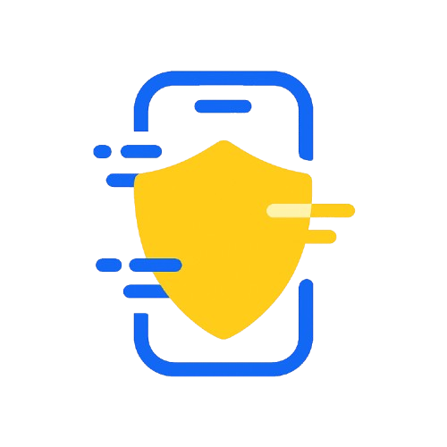

# Hackathon do Banco do Brasil

# Rolê Seguro 

  

<i>Curta o momento e a gente cuida do resto</i>

#

## Membros do Time

  <table>
    <tr>
      <td align="center">
        <a href="https://www.linkedin.com/in/david-deodato/">
           
          <b>David Deodato</b>
        </a>
      </td>
      <td align="center">
        <a href="https://www.linkedin.com/in/llorengarcia/">
           
          <b>Lorena Garcia</b>
        </a>
      </td>
      <td align="center">
        <a href="https://www.linkedin.com/in/rayssaguedess/">
           
          <b>Rayssa Guedes</b>
        </a>
      </td>
    </tr>
  </table>

## Descrição  

&emsp;O **Rolê Seguro** é um microseguro contextual e digital da **BB Seguros**, desenvolvido para oferecer **proteção sob medida aos jovens (18-35 anos)** durante **eventos, festas e atividades universitárias**.  

&emsp;A solução integra-se diretamente em **aplicativos de ingressos, carteirinhas universitárias e ecossistemas de lazer**, permitindo que o usuário **ative o seguro com um clique** no momento do check-in ou da compra - sem burocracia, sem formulários e com cobertura imediata.  

> Em essência: o BB Rolê Seguro transforma segurança em conveniência - protegendo os bens dos jovens nos momentos que mais importam.  

---

## Problema Resolvido  

&emsp;Em grandes centros urbanos, jovens sofrem com **roubos de celulares e golpes de transações sob coação** durante eventos e trajetos noturnos.  
Segundo dados de segurança pública, o **roubo de celulares representa mais de 50% dos furtos urbanos** em capitais como São Paulo e Rio de Janeiro, afetando principalmente o público de 18 a 35 anos - grupo com **alta mobilidade, vida noturna ativa e forte dependência digital**.  

&emsp;Além da perda material, há o **impacto psicológico e financeiro**, pois a maioria não possui seguro, e o bloqueio de contas e apps é demorado.  

O **Rolê Seguro** enfrenta esse cenário ao:  
- Oferecer **proteção imediata e por uso** (pague apenas quando precisar);  
- Cobrir **roubo do celular e transações sob coação**;  
- Integrar **assistência digital pós-ocorrência** (bloqueio rápido, Gov.br “Celular Seguro”);  
- Proporcionar **processo 100% digital**, do check-in ao reembolso.  

> **Resumo:** o produto redefine o seguro como um serviço fluido e contextual, onde o jovem sente-se protegido sem fricção.

---

## Tecnologia  

A arquitetura do **Rolê Seguro** é **modular, escalável e integrada via APIs**.  

| **Camada** | **Tecnologia** | **Função Principal** |
|-------------|----------------|----------------------|
| **Frontend (SDK)** | React + TypeScript | Módulo embarcável para apps de ingressos e carteirinhas. |
| **Backend (Core)** | Node.js + Express + GraphQL | Processamento de apólices, integração com BB Seguros e antifraude. |
| **Banco de Dados** | PostgreSQL + Prisma ORM | Registro de apólices, sinistros e logs de eventos. |
| **IA & Antifraude** | Python (FastAPI) + OpenAI API | Classificação de sinistros, verificação contextual e “escada de evidências”. |
| **Geolocalização e Validação** | Google Maps API + Geofencing SDK | Define o perímetro e tempo de cobertura (check-in → check-out). |
| **Infraestrutura** | AWS Lambda + S3 + CloudFront | Arquitetura serverless, com custo sob demanda e alta disponibilidade. |
| **Segurança e LGPD** | Criptografia AES-256 + Anonimização de dados | Proteção de dados pessoais e rastreamento ético. |

---

## Características-Chave  

| **Categoria** | **Descrição** |
|----------------|----------------|
| ⚡ **Ativação Instantânea** | O seguro é oferecido no **momento do check-in e da compra**, com ativação em 1 clique. |
| 📍 **Cobertura Contextual** | Vigência limitada ao **perímetro e duração do evento**, com **geofencing** automático. |
| 🔐 **Escada de Evidências Antifraude** | Validação em duas camadas: **FastTrack (R$ até 400)** e **Full (R$ até 3.000)**, conforme comprovação. |
| 🤖 **IA de Verificação** | A IA analisa consistência entre GPS, horário e bloqueios realizados (operadora, Apple/Google, Gov.br). |
| 💸 **Transações sob Coação** | Cobre prejuízos por **PIX ou saques forçados** até 2h após o evento. |
| 🔔 **Assistência Digital Pós-Rolê** | Passo a passo de bloqueios e atalhos diretos para **Celular Seguro (Gov.br)**. |
| 🤝 **Integração Simples via SDK** | Parceiros podem incluir o seguro em apps com poucas linhas de código. |
| 🧾 **Apólice Modular (por evento ou assinatura)** | “Pague por evento” ou assine o **Passe do Rolê** para proteção mensal. |
| 🧠 **Analytics e Dashboard BB** | Painel para monitorar adesão, sinistros e insights por tipo de evento. |
| 🔒 **Compliance e LGPD** | Dados tratados de forma anonimizada e auditável pela SUSEP. |

---

## Validação e Mitigação de Riscos  

Para garantir sustentabilidade e reduzir fraudes:  
- **Geofencing + Janela Temporal:** cobertura ativa apenas dentro do perímetro e durante o evento.  
- **Provas Mínimas:** check-in validado, geolocalização, bloqueio de dispositivo e/ou protocolo Celular Seguro.  
- **Machine Learning Antifraude:** detecção de padrões anômalos (múltiplos sinistros por CPF, incoerências de GPS).  
- **Parceria com Universidades e Apps de Ticketing:** pilotos controlados com amostras reais e análise de adesão.  

---

## Impacto Esperado  

| **Dimensão** | **Métrica Esperada (MVP)** |
|---------------|----------------------------|
| 🎯 **Adoção** | +20% de adesão em eventos universitários parceiros. |
| 💰 **Custo/Benefício** | Prêmio médio de R$ 2,90 / evento — alta acessibilidade. |
| 📉 **Sinistralidade Alvo** | < 35% (MVP com “escada de evidências”). |
| ❤️ **NPS Jovem** | +70 (sensação de segurança e confiança na marca BB). |
| 🔄 **Conversão Pós-Piloto** | Migração para modelo de **assinatura mensal (Passe do Rolê)**. |

---

