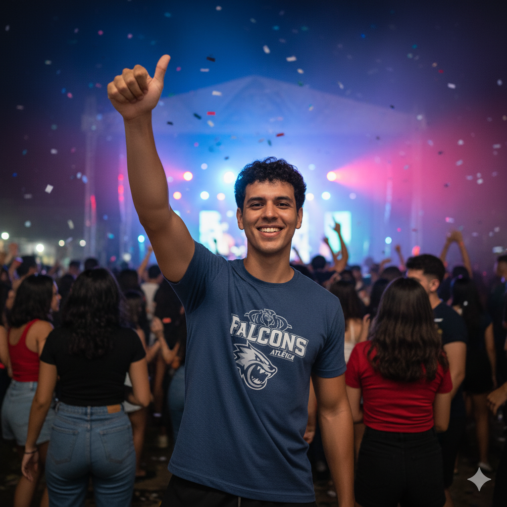

# Personas

## Contexto

Estas personas representam os perfis de usuários do **BB Rolê Seguro**, priorizando o **público jovem (18-35 anos)** como core. Lucas, o universitário, é a persona primária que guia decisões de produto, UX e comunicação. Renato representa um perfil secundário de expansão, demonstrando que a solução é escalável para outros públicos, mas sem perder o foco no jovem como usuário principal.

---

### Persona Primária: Lucas – Atleta Universitário

  
  

**Prioridade: Core / Público-alvo principal**

#### Quem é o Lucas?

Lucas tem **22 anos**, é estudante de Educação Física e integrante ativo da **atlética universitária**. Participa e organiza **torneios, festas de integração e jogos intercampi**. Já presenciou furtos de celular em campeonatos e viu colegas perderem dinheiro em golpes pós-evento.

Ele é digital, usa apps de ingresso, QR Code e pagamentos instantâneos (PIX). Valoriza praticidade e custo acessível; não contrataria um seguro anual tradicional, mas aceita pagar por cobertura contextual por evento.

#### Motivadores

- Segurança durante eventos esportivos e festas pós-jogo.
- Facilidade de ativar no momento da compra ou check-in.
- Rapidez no reembolso sem burocracia.
- Transparência sobre o que está coberto e limites.

#### Desafios / Dor

- Baixa confiança em processos tradicionais de seguro ("demoram e negam").
- Não quer instalar apps pesados ou preencher formulários longos.
- Dificuldade em acompanhar múltiplos eventos e saber se a cobertura está ativa.
- Falta de canal simples para abrir sinistro e anexar evidências.

#### Objetivos

- Ativar a cobertura com 1 clique junto ao ingresso ou inscrição.
- Ver claramente período e perímetro da cobertura (geofencing).
- Abrir sinistro rápido (upload de evidências: protocolo, bloqueio, descrição).
- Receber reembolso ágil em casos de roubo de celular ou transações sob coação.
- Acompanhar status do sinistro e histórico no painel.

#### User Stories de Lucas

| ID   | Como                    | Quero                                                   | Para                                   |
| ---- | ----------------------- | ------------------------------------------------------- | -------------------------------------- |
| US01 | atleta participante     | adicionar o Rolê Seguro ao comprar/validar meu ingresso | entrar no evento já protegido          |
| US02 | organizador eventual    | visualizar quantos participantes ativaram o seguro      | avaliar adesão e comunicar benefícios  |
| US03 | usuário após ocorrência | abrir sinistro enviando evidências mínimas              | acelerar análise e reembolso           |
| US04 | atleta conectado        | consultar minha cobertura ativa e tempo restante        | saber se ainda estou protegido ao sair |
| US05 | participante recorrente | migrar para um passe mensal                             | evitar ter que ativar em cada evento   |

---

---

### Persona Secundária: Renato – Fã de Shows

  
  

**Prioridade: Expansão / Público secundário**

#### Quem é o Renato?

Renato tem **39 anos**, trabalha como analista de TI e é um **fã assíduo de rock, metal e festivais de música**. Vai a diversos **shows, grandes eventos em arenas e festivais multi-palco** ao longo do ano. Já teve um celular furtado em um show lotado e perdeu horas bloqueando apps e contas.

Ele não se vê mais como "público universitário", mas quer uma solução moderna que funcione em qualquer ambiente de entretenimento pago. Valoriza previsibilidade, suporte confiável e automação pós-incidente.

**Contexto de uso:** Renato representa o público adulto (35-45 anos) que demonstra a escalabilidade do produto, mas não é o foco primário de marketing e desenvolvimento de features.

#### Motivadores

- Proteger investimento em dispositivos e ingressos caros.
- Reduzir estresse pós-roubo (bloqueios e protocolos).
- Ter uma solução não restrita a “festas de faculdade”.
- Simplificar abertura e acompanhamento de sinistro.

#### Desafios / Dor

- Ambientes com alta densidade (pit, áreas premium) elevam risco de furto.
- Processos tradicionais de seguro são pouco contextualizados a eventos.
- Dificuldade em lembrar de ativar algo antes de cada show.
- Ansiedade sobre golpes de transações forçadas após eventos noturnos.

#### Objetivos

- Ativar cobertura rapidamente no checkout do ingresso ou via integração no app da ticketeira.
- Confirmar visualmente (no wallet / app) que a proteção está ativa para aquele show.
- Receber orientação automatizada pós-ocorrência (bloqueios, Celular Seguro, operadora).
- Ter opção de **Passe do Rolê** para shows mensais sem repetição de ativação.
- Acompanhar histórico de sinistros e limites usados.

#### User Stories de Renato

| ID   | Como                  | Quero                                      | Para                                       |
| ---- | --------------------- | ------------------------------------------ | ------------------------------------------ |
| US01 | fã de shows           | ativar o microseguro ao comprar ingresso   | estar protegido sem contratar seguro anual |
| US02 | usuário após sinistro | receber checklist guiado de bloqueios      | minimizar prejuízos e tempo de resposta    |
| US03 | assinante frequente   | aderir a um passe mensal                   | eliminar atrito de múltiplas ativações     |
| US04 | usuário experiente    | acessar relatórios de sinistro e cobertura | entender uso e planejar próximos eventos   |
| US05 | fã preocupado         | confirmar geofencing e janela de cobertura | saber até quando estou protegido pós-show  |

---

### Comparativo e Priorização

| Dimensão             | Lucas                  | Renato                        |
| -------------------- | ---------------------------------------- | ------------------------------------------------ |
| Faixa Etária         | 22 anos (18-28)                          | 39 anos (35-45)                                  |
| Contexto Primário    | Jogos universitários, torneios, festas   | Shows, festivais, arenas de grande porte         |
| Frequência           | Alta em períodos letivos                 | Moderada a alta (agenda de turnês)               |
| Motivação Principal  | Conveniência + baixo custo               | Proteção patrimonial + redução de estresse       |
| Ativação Preferida   | No check-in ou compra de inscrição       | No checkout do ingresso ou assinatura mensal     |
| Canal de Engajamento | App da atlética / SDK integrado          | App de ticketing / carteira de ingressos         |
| Dor Central          | Furtos recorrentes em eventos esportivos | Perda de dispositivo premium + golpes pós-evento |

**Decisão de Produto:** Lucas guia 80% das decisões de UX, pricing, linguagem e parcerias iniciais. Renato valida escalabilidade e orienta features de assinatura (Passe do Rolê).

---

